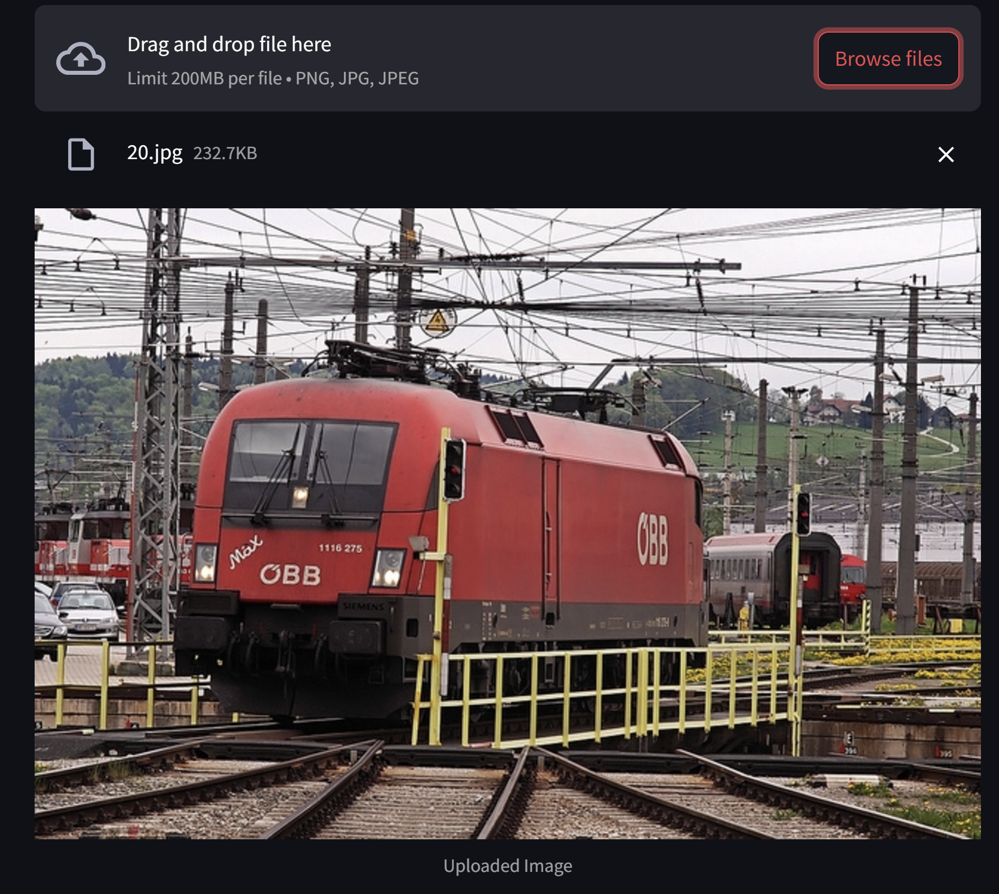

# Object-Text-Detection-and-Recognition-System
 
This project demonstrates the integration object and text detection system. It includes a trained YOLOv8 model for object detection (on a subset of the COCO dataset with 42 classes), leveraging NVIDIA CUDA for efficient computation. It is integrated with Keras OCR for text detection and recognition. A Streamlit-based frontend ties everything together for an intuitive user experience. To understand the working behind Keras OCR, custom text recognition system is built using CRNN.

## Features

1. **Object Detection**:
   - **Model**: YOLOv8 (Ultralytics).
   - **Dataset**: [Coco dataset](https://www.kaggle.com/datasets/awsaf49/coco-2017-dataset) Model was trained on 42 selected classes from the COCO dataset, all of which include text elements.
   - **Annotations**:
     - Preprocessing converts a single JSON annotations file into separate files for each image.
     - Generates a `coco.yaml` file, used as input for training the YOLOv8 model.
   - **Trained Model**: Training uses `coco.yaml` , `yolov8n.pt` as input and results are stored in `runs/detect`.
   - **Environment**: Trained and run using NVIDIA CUDA 12.1 for optimal GPU acceleration.

2. **Optical Character Recognition (OCR)**:
   - **Comparisons**:
     - `TesseractOCR`, `EasyOCR`, and `KerasOCR` are compared in terms of accuracy and efficiency.

3. **Custom Text Recognition**:
   - **Model**: CRNN (Convolutional Recurrent Neural Network).
   - **Dataset**: [CAPTCHA dataset](https://www.kaggle.com/datasets/fournierp/captcha-version-2-images)
   - **Purpose**: To understand the working of text recognition system using CRNN.

4. **Frontend**:
   - Developed using **Streamlit**.
   - Features include:
     - Image upload functionality. 
     - Object detection and bounding box prediction using **YOLOV8** results.
     - Text detection and recognition performed using **Keras OCR**.
       


## Installation

### Prerequisites
- Python 3.8 or later
- Libraries:
  - `streamlit`, `ultralytics`, `keras-ocr`, `easyocr`, `opencv-python`, `numpy`, `tensorflow`, `matplotlib`, `pandas`, `seaborn`
  - For TesseractOCR: Install Tesseract
  - **GPU Acceleration**: NVIDIA CUDA 12.1

## Usage

### 1. Object Detection Training
- Use `object_detection.ipynb` to preprocess annotation files, create `coco.yaml`, and train the YOLOv8 model.
- Final weights are saved as `best.pt` in the `runs/detect/train/weights/` directory.

### 2. OCR Comparisons
- Run `OCR.ipynb` to compare Tesseract, EasyOCR, and KerasOCR for text detection and recognition.

### 3. Custom Text Recognition
- Use `custom_text_recognition.ipynb` to train and evaluate the CRNN model on the CAPTCHA dataset.

### 4. Frontend Application
- Start the Streamlit app:
  ```bash
  streamlit run frontend.py
  ```
- Upload an image and view:
  - **Object Detection Results**: Bounding boxes drawn around detected objects using YOLOv8.
  - **Text Detection and Recognition**: Results displayed with Keras OCR.

##  Output

### 1. Uploaded Image


### 2. Keras OCR Output


### 3. YOLOv8 Output


